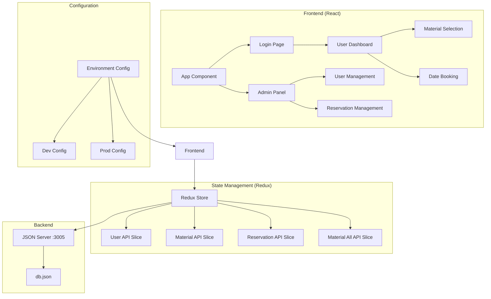
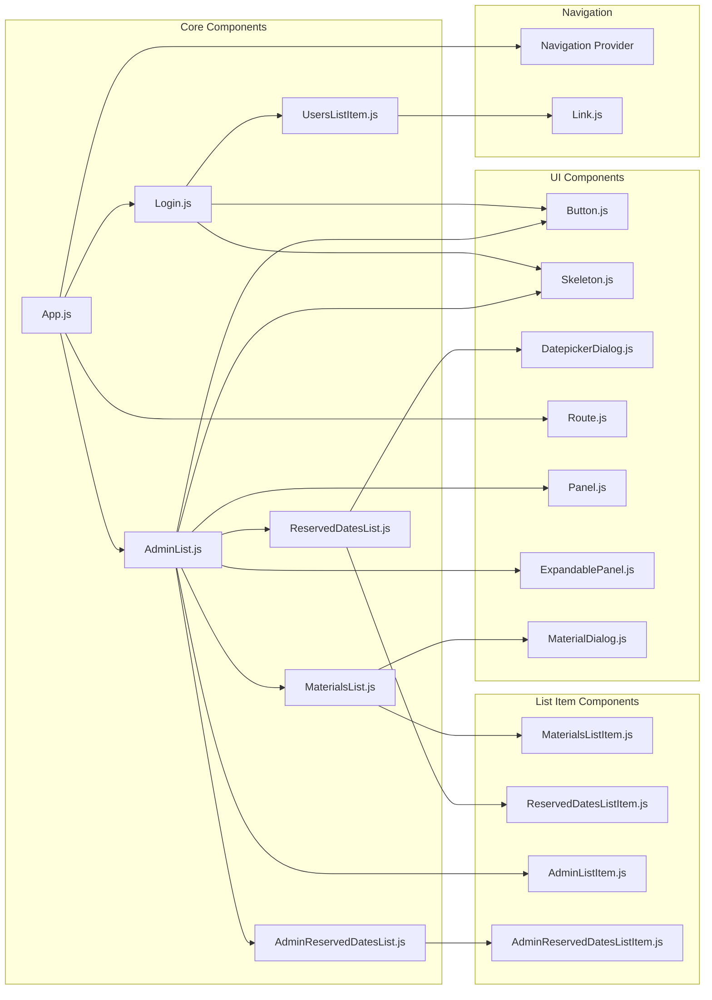
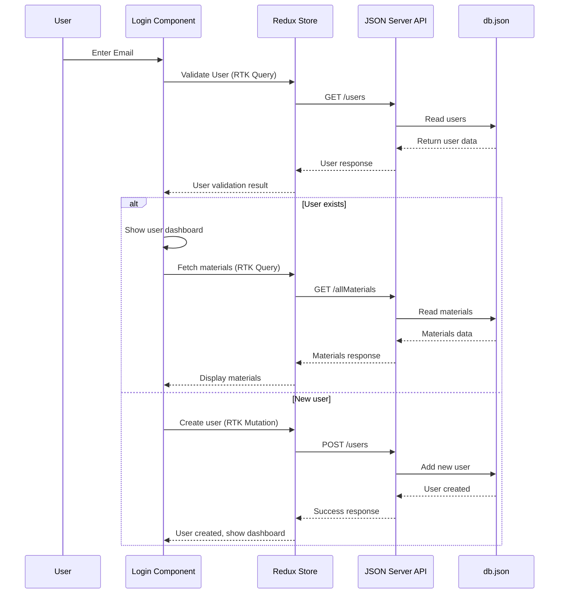
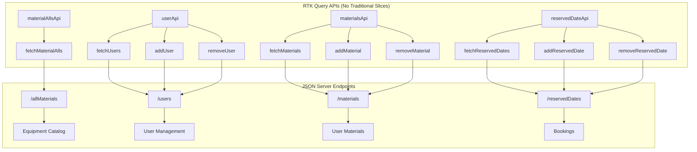
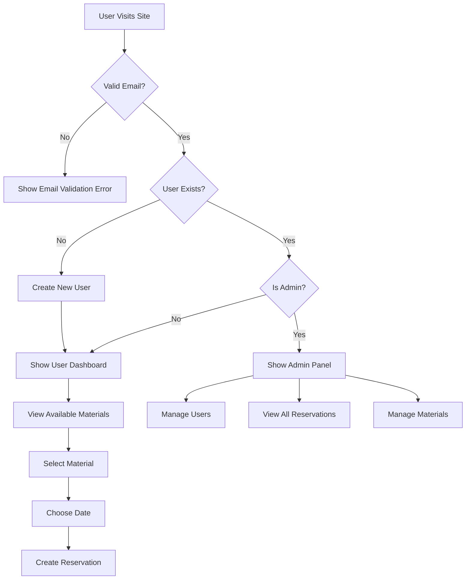
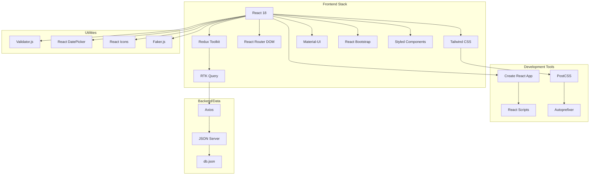
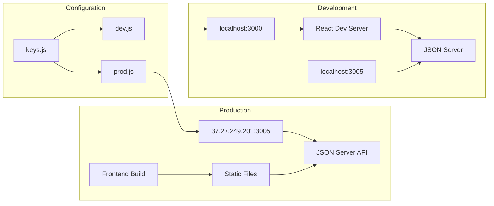

# NBV Resource Booking System - Architecture

## System Overview



## Component Architecture



## Data Flow Architecture



## Redux Store Architecture

The application uses Redux Toolkit with RTK Query for all state management. There are no traditional Redux slices - all state is managed through RTK Query APIs.

### Custom Hooks
- `use-navigation.js` - Custom hook for navigation context
- `useThunk.js` - Hook for dispatching thunk actions

## API Architecture



## User Flow Diagram



## Technology Stack



## Deployment Architecture



## File Structure

```
src/
├── components/              # React components
│   ├── navigation/         # Navigation provider
│   │   └── Navigation.js
│   ├── Login.js            # User authentication
│   ├── AdminList.js        # Admin dashboard
│   ├── AdminListItem.js    # Admin list items
│   ├── AdminReservedDatesList.js
│   ├── AdminReservedDatesListItem.js
│   ├── MaterialsList.js    # Equipment catalog
│   ├── MaterialsListItem.js
│   ├── MaterialDialog.js   # Material selection dialog
│   ├── ReservedDatesList.js
│   ├── ReservedDatesListItem.js
│   ├── UsersListItem.js
│   ├── DatepickerDialog.js # Date picker component
│   ├── Panel.js            # Panel wrapper
│   ├── ExpandablePanel.js  # Expandable panel
│   ├── Button.js           # Reusable button
│   ├── Skeleton.js         # Loading skeleton
│   ├── Route.js            # Route component
│   └── Link.js             # Navigation link
├── store/                  # Redux store (RTK Query only)
│   ├── apis/              # RTK Query API definitions
│   │   ├── materialAllsApi.js
│   │   ├── materialsApi.js
│   │   ├── reservedDateApi.js
│   │   └── userApi.js
│   └── index.js           # Store configuration
├── hooks/                 # Custom hooks
│   ├── use-navigation.js  # Navigation context hook
│   └── useThunk.js        # Thunk dispatch hook
├── config/                # Environment config
│   ├── keys.js            # Config selector
│   ├── dev.js             # Development settings
│   └── prod.js            # Production settings
├── utilities/             # Helper functions
│   └── dateFunctions.js   # Date utilities
└── App.js                 # Root component
```