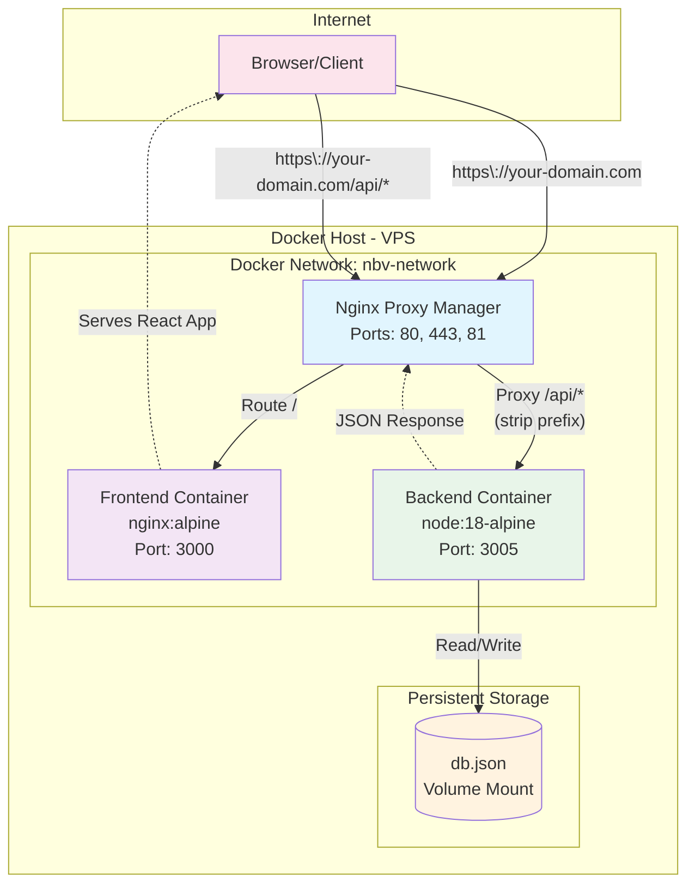
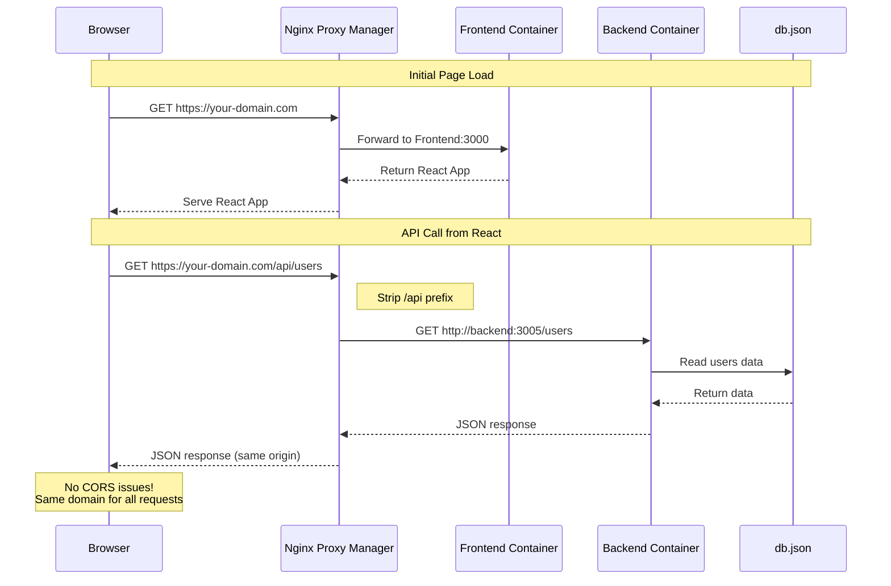

# NBV Resource Booking System - Deployment Guide

This guide covers deploying the NBV Resource Booking System on a Hetzner VPS (or any Linux server) using Docker, Docker Compose, and Nginx Proxy Manager.

## Table of Contents
- [Prerequisites](#prerequisites)
- [Architecture Overview](#architecture-overview)
- [Docker Concepts Explained](#docker-concepts-explained)
- [Initial Server Setup](#initial-server-setup)
- [Deployment Steps](#deployment-steps)
- [Nginx Proxy Manager Configuration](#nginx-proxy-manager-configuration)
- [SSL Configuration](#ssl-configuration)
- [IP-Only Deployment (No Domain)](#ip-only-deployment-no-domain)
- [Maintenance](#maintenance)
- [Troubleshooting](#troubleshooting)
- [Backup and Recovery](#backup-and-recovery)

## Prerequisites

### Server Requirements
- Ubuntu 22.04 LTS or similar Linux distribution
- Minimum 2GB RAM
- 20GB disk space
- Public IP address
- Domain name pointing to your server

### Software Requirements
- Docker Engine 20.10+
- Docker Compose 2.0+
- Git
- Basic firewall (ufw or iptables)

## Architecture Overview

### Docker Container Architecture
```
┌──────────────────────────────────────────────────────────────┐
│                     Docker Host (VPS)                        │
│                                                              │
│  ┌────────────────────────────────────────────────────┐     │
│  │            Docker Network: nbv-network             │     │
│  │                                                    │     │
│  │  ┌──────────────────────────────────────────┐     │     │
│  │  │   Nginx Proxy Manager Container          │     │     │
│  │  │   - Public Ports: 80, 443, 81           │     │     │
│  │  │   - Handles SSL/TLS                     │     │     │
│  │  │   - Routes requests based on path       │     │     │
│  │  └──────────────┬───────────────────────────┘     │     │
│  │                 │                                  │     │
│  │     ┌───────────┴────────────┐                   │     │
│  │     │                        │                   │     │
│  │  ┌──▼─────────────┐   ┌─────▼──────────┐       │     │
│  │  │ Frontend        │   │ Backend         │       │     │
│  │  │ Container       │   │ Container       │       │     │
│  │  │                 │   │                 │       │     │
│  │  │ nginx:alpine    │   │ node:18-alpine  │       │     │
│  │  │ Port 3000       │   │ Port 3005       │       │     │
│  │  │ (internal)      │   │ (internal)      │       │     │
│  │  └─────────────────┘   └────────┬────────┘       │     │
│  │                                  │                │     │
│  └──────────────────────────────────┼────────────────┘     │
│                                     │                       │
│                          ┌──────────▼──────────┐            │
│                          │   Volume Mount      │            │
│                          │   ./data/db/        │            │
│                          │   (Persistent)      │            │
│                          └─────────────────────┘            │
└──────────────────────────────────────────────────────────────┘
```

### Request Flow
```
Browser (Client)
    │
    ├─[GET your-domain.com]────────────► NPM ─────► Frontend Container
    │                                              (serves React app)
    │
    └─[GET your-domain.com/api/users]──► NPM ─────► Backend Container
                                         (proxy)    (JSON Server)
                                           │
                                           └─ Strips /api prefix
                                              Forwards as /users
```

### How Browser-to-Backend Communication Works

1. **Browser loads React app**:
   - Request: `https://your-domain.com`
   - NPM routes to Frontend container
   - nginx serves the built React app

2. **React app makes API calls**:
   - Request: `https://your-domain.com/api/users`
   - NPM receives request on same domain (no CORS)
   - NPM strips `/api` prefix via rewrite rule
   - NPM forwards to Backend container as `/users`
   - Backend responds with JSON data
   - NPM returns response to browser

3. **Why this works**:
   - All requests go through same domain
   - Internal Docker network for container communication
   - No exposed backend ports (security)
   - SSL termination at NPM level

### Architecture Diagram (Mermaid)



### Request Flow Sequence (Mermaid)



## Docker Concepts Explained

Understanding the Docker components used in this deployment will help you troubleshoot and maintain your application.

### Docker Containers

**What they are**: Lightweight, standalone packages that include everything needed to run an application - code, runtime, libraries, and dependencies.

**In our setup**:
- **Frontend Container**: Runs nginx with the built React application
- **Backend Container**: Runs Node.js with JSON Server
- **Nginx Proxy Manager Container**: Handles reverse proxy, SSL, and routing

**Benefits**:
- ✅ Consistent environment across development and production
- ✅ Easy to scale, update, or replace individual components
- ✅ Isolation prevents conflicts between services

### Docker Networks

**What it is**: A virtual network that allows containers to communicate with each other securely.

**In our setup**:
- Network name: `nbv-network`
- All three containers are connected to this network
- Containers can reach each other by container name (e.g., `frontend`, `backend`)
- External traffic only reaches containers through NPM

**Benefits**:
- ✅ Internal communication doesn't go through public internet
- ✅ Security through network isolation
- ✅ Easy service discovery (containers find each other by name)

### Volume Mounts

**What they are**: A way to persist data outside of containers, so data survives container restarts and updates.

**In our setup**:
```
Host Directory                    Container Path              Purpose
./data/db/                   →    /data                      Database persistence
./data/nginx-proxy-manager/  →    /data                      NPM settings & SSL certs
./data/nginx-proxy-manager/  →    /etc/letsencrypt          SSL certificates
```

**Benefits**:
- ✅ Database survives backend container restarts
- ✅ SSL certificates persist across NPM updates
- ✅ Easy backups (just copy the data directories)
- ✅ Configuration changes persist

### Docker Host

**What it is**: The physical or virtual machine (your VPS) that runs the Docker engine and all containers.

**In our setup**:
- Your Hetzner VPS is the Docker host
- Runs Ubuntu with Docker engine installed
- Manages container lifecycle, networking, and storage
- Only ports 80, 443, and 81 are exposed to the internet

**Benefits**:
- ✅ One server manages all application components
- ✅ Resource sharing between containers
- ✅ Centralized monitoring and logging

### Docker Compose

**What it is**: A tool for defining and running multi-container Docker applications using a YAML file.

**Our docker-compose.yml defines**:
- Which containers to run
- How containers connect to each other
- Port mappings and volume mounts
- Environment variables and dependencies

**Benefits**:
- ✅ Single command to start/stop entire application
- ✅ Ensures containers start in correct order
- ✅ Easy to replicate setup on different servers
- ✅ Version controlled infrastructure as code

### How It All Works Together

1. **Docker Compose** reads the configuration file and creates:
   - The `nbv-network` network
   - Three containers from their respective images
   - Volume mounts for data persistence

2. **Containers communicate** through the internal network:
   - NPM can reach `frontend:3000` and `backend:3005`
   - Backend can read/write to the mounted database volume
   - Only NPM exposes ports to the outside world

3. **Data persists** through volume mounts:
   - Your booking data stays safe in `./data/db/`
   - NPM configuration and SSL certificates are preserved
   - Container updates don't lose data

4. **The Docker Host** manages it all:
   - Starts containers automatically on boot
   - Handles resource allocation
   - Provides logging and monitoring capabilities

This containerized approach makes your application:
- **Portable**: Works the same on any Docker-capable server
- **Scalable**: Easy to add more instances or services
- **Maintainable**: Updates are isolated and reversible
- **Secure**: Services are isolated from each other and the host

## Initial Server Setup

### 1. Connect to Your Server
```bash
ssh root@your-server-ip
```

### 2. Update System
```bash
apt update && apt upgrade -y
```

### 3. Install Docker
```bash
# Install Docker
curl -fsSL https://get.docker.com -o get-docker.sh
sh get-docker.sh

# Install Docker Compose
apt install docker-compose-plugin -y

# Verify installation
docker --version
docker compose version
```

### 3a. Option B: Standalone Nginx Proxy Manager Installation

**Note**: The main docker-compose.yml already includes Nginx Proxy Manager. Use this standalone installation only if you want to run NPM separately (e.g., to manage multiple applications with a single NPM instance).

To install Nginx Proxy Manager separately from your application, follow the [official quick setup guide](https://nginxproxymanager.com/guide/#quick-setup):

```bash
# Create directory for NPM
mkdir -p /opt/nginx-proxy-manager
cd /opt/nginx-proxy-manager

# Create docker-compose.yml (from official guide)
cat > docker-compose.yml << 'EOF'
version: '3.8'
services:
  app:
    image: 'jc21/nginx-proxy-manager:latest'
    restart: unless-stopped
    ports:
      - '80:80'
      - '81:81'
      - '443:443'
    volumes:
      - ./data:/data
      - ./letsencrypt:/etc/letsencrypt
EOF

# Start NPM
docker compose up -d
```

Access the admin panel at `http://your-server-ip:81`
- Default email: `admin@example.com`
- Default password: `changeme` (change immediately!)

For more details and advanced configuration, see the [official Nginx Proxy Manager documentation](https://nginxproxymanager.com/guide/).

**Note**: If using standalone NPM, modify the main `docker-compose.yml` to remove the nginx-proxy-manager service and ensure your app services are accessible on their respective ports.

### 4. Configure Firewall
```bash
# Install ufw if not present
apt install ufw -y

# Allow SSH (important!)
ufw allow 22/tcp

# Allow HTTP and HTTPS
ufw allow 80/tcp
ufw allow 443/tcp

# Allow NPM admin interface (restrict to your IP for security)
ufw allow from YOUR_IP to any port 81

# Enable firewall
ufw enable
```

### 5. Create Deployment User (Optional but Recommended)
```bash
# Create user
adduser deploy

# Add to docker group
usermod -aG docker deploy

# Add sudo privileges
usermod -aG sudo deploy

# Switch to deploy user
su - deploy
```

## Deployment Steps

### 1. Clone Repository
```bash
# Navigate to opt directory
cd /opt

# Clone your repository
sudo git clone https://github.com/your-username/your-repo.git nbv-booking
cd nbv-booking

# Set proper permissions
sudo chown -R $USER:$USER .
```

### 2. Create Required Directories
```bash
# Create data directories for persistent storage
mkdir -p data/nginx-proxy-manager/data
mkdir -p data/nginx-proxy-manager/letsencrypt
mkdir -p data/db

# Copy initial database
cp backend/db.json data/db/db.json
```

### 3. Configure Environment
```bash
# Copy environment template
cp .env.example .env

# Edit environment variables
nano .env
```

Update the following in `.env`:
- `DOMAIN`: Your actual domain name
- `LETSENCRYPT_EMAIL`: Your email for SSL certificates
- `NPM_DB_PASSWORD`: Strong password for NPM database

### 4. Build and Start Services
```bash
# Build images and start containers
docker compose up -d --build

# View logs to ensure everything started correctly
docker compose logs -f

# Press Ctrl+C to exit logs
```

### 5. Verify Services
```bash
# Check all containers are running
docker compose ps

# Should show:
# - nbv-nginx-proxy-manager (healthy)
# - nbv-frontend (healthy)
# - nbv-backend (healthy)
```

## Nginx Proxy Manager Configuration

### 1. Access NPM Admin Interface
Open your browser and navigate to:
```
http://your-server-ip:81
```

### 2. Initial Login
Default credentials:
- Email: `admin@example.com`
- Password: `changeme`

**Important**: Change these immediately after first login!

### 3. Configure Proxy Hosts

#### Frontend Proxy
1. Click "Proxy Hosts" → "Add Proxy Host"
2. Configure:
   - **Domain Names**: `your-domain.com` (and `www.your-domain.com` if desired)
   - **Scheme**: `http`
   - **Forward Hostname/IP**: `frontend`
   - **Forward Port**: `3000`
   - **Cache Assets**: ✓
   - **Block Common Exploits**: ✓
   - **Websockets Support**: ✓ (if needed)

#### API Proxy

**How this works**: The React frontend makes API calls directly from the browser to `/api/*` endpoints. These requests are proxied through NPM to the backend, avoiding CORS issues since everything appears to come from the same domain.

**Request flow example**:
1. Browser loads React app from `your-domain.com`
2. React app makes API call to `/api/users` (same domain, no CORS)
3. NPM receives the request at `your-domain.com/api/users`
4. NPM strips the `/api` prefix (becomes `/users`)
5. NPM forwards to `backend:3005/users`
6. Backend responds with JSON data
7. NPM returns response to browser

**Configuration steps**:
1. Click "Add Proxy Host"
2. Configure:
   - **Domain Names**: `your-domain.com`
   - **Scheme**: `http`
   - **Forward Hostname/IP**: `backend`
   - **Forward Port**: `3005`
3. In "Custom Locations" tab, add:
   - **Location**: `/api`
   - **Scheme**: `http`
   - **Forward Hostname/IP**: `backend`
   - **Forward Port**: `3005`
   - **Advanced**: Add custom Nginx configuration:
   ```nginx
   rewrite ^/api/(.*)$ /$1 break;
   ```

**Why this setup**:
- ✅ No CORS issues (same origin policy satisfied)
- ✅ Clean URLs without port numbers
- ✅ SSL works for both frontend and API
- ✅ Backend port (3005) not exposed publicly
- ✅ All API calls go through the same domain

## SSL Configuration

### 1. Request SSL Certificate
1. Edit your proxy host
2. Go to "SSL" tab
3. Select "Request a new SSL Certificate"
4. Enable:
   - Force SSL ✓
   - HTTP/2 Support ✓
   - HSTS Enabled ✓
5. Enter email and agree to terms
6. Click "Save"

NPM will automatically obtain and configure Let's Encrypt certificates.

## IP-Only Deployment (No Domain)

If you don't have a domain name and want to use your server's IP address directly, follow these modified steps.

### NPM Configuration with IP Address

#### 1. Access NPM Admin Panel
```
http://YOUR_SERVER_IP:81
```
Example: `http://192.168.1.100:81` or `http://37.27.249.201:81`

Default login: `admin@example.com` / `changeme`

#### 2. Frontend Proxy Configuration
1. Click "Proxy Hosts" → "Add Proxy Host"
2. Configure:
   - **Domain Names**: `YOUR_SERVER_IP` (e.g., `192.168.1.100`)
   - **Scheme**: `http`
   - **Forward Hostname/IP**: `frontend`
   - **Forward Port**: `3000`
   - **Cache Assets**: ✓
   - **Block Common Exploits**: ✓

#### 3. API Proxy Configuration
1. Click "Add Proxy Host"
2. Configure:
   - **Domain Names**: `YOUR_SERVER_IP` (same IP as above)
   - **Scheme**: `http`
   - **Forward Hostname/IP**: `backend`
   - **Forward Port**: `3005`
3. In "Custom Locations" tab, add:
   - **Location**: `/api`
   - **Scheme**: `http`
   - **Forward Hostname/IP**: `backend`
   - **Forward Port**: `3005`
   - **Advanced**: Add custom Nginx configuration:
   ```nginx
   rewrite ^/api/(.*)$ /$1 break;
   ```

### Important Notes for IP-Only Setup

#### Access URLs
- **Frontend**: `http://YOUR_SERVER_IP`
- **NPM Admin**: `http://YOUR_SERVER_IP:81`
- **API endpoints**: `http://YOUR_SERVER_IP/api/*`

#### No SSL Available
- Cannot use Let's Encrypt SSL without a domain
- Application runs on HTTP only (port 80)
- For production, consider purchasing a domain for SSL support

#### Production Config Considerations
The current setup uses relative paths (`/api`) which works with IP addresses through NPM proxy. No changes needed to the application code.

### Alternative: Direct Port Access (Bypass NPM)

If you prefer to access services directly via ports:

#### 1. Modify docker-compose.yml
Add port mappings to expose services directly:

```yaml
services:
  frontend:
    # ... existing config ...
    ports:
      - "3000:3000"

  backend:
    # ... existing config ...
    ports:
      - "3005:3005"

  # Comment out or remove nginx-proxy-manager service
```

#### 2. Update Application Configuration
Modify `src/config/prod.js`:
```javascript
module.exports = {
    url: 'http://YOUR_SERVER_IP:3005'
}
```

#### 3. Access URLs
- **Frontend**: `http://YOUR_SERVER_IP:3000`
- **Backend API**: `http://YOUR_SERVER_IP:3005`

#### 4. Firewall Configuration
```bash
# Allow additional ports
ufw allow 3000/tcp  # Frontend
ufw allow 3005/tcp  # Backend API
```

### When to Use Each Approach

**NPM with IP (Recommended)**:
- ✅ Single entry point (port 80)
- ✅ Path-based routing (/api)
- ✅ Easier to add SSL later with domain
- ✅ Professional setup

**Direct Port Access**:
- ✅ Simpler for development/testing
- ✅ No proxy configuration needed
- ❌ Multiple ports to manage
- ❌ Less secure (more exposed ports)

### Security Considerations for IP-Only

1. **Firewall Protection**: Restrict access to your IP or network
```bash
# Allow only from your IP
ufw allow from YOUR_HOME_IP to any port 80
ufw allow from YOUR_HOME_IP to any port 81
```

2. **Change Default Passwords**: Update NPM admin credentials immediately

3. **Consider VPN**: For remote access, use VPN instead of exposing to internet

4. **Monitor Access**: Regularly check NPM access logs for unauthorized attempts

## Maintenance

### Viewing Logs
```bash
# All services
docker compose logs -f

# Specific service
docker compose logs -f backend
docker compose logs -f frontend
docker compose logs -f nginx-proxy-manager
```

### Restarting Services
```bash
# Restart all services
docker compose restart

# Restart specific service
docker compose restart backend
```

### Updating Application
```bash
# Pull latest changes
git pull origin main

# Rebuild and restart
docker compose down
docker compose up -d --build
```

### Database Management
```bash
# Backup database
cp data/db/db.json data/db/db.json.backup

# Restore database
cp data/db/db.json.backup data/db/db.json
docker compose restart backend
```

## Troubleshooting

### Container Won't Start
```bash
# Check logs
docker compose logs [service-name]

# Check container status
docker compose ps

# Rebuild specific service
docker compose build --no-cache [service-name]
```

### Port Already in Use
```bash
# Find process using port
lsof -i :PORT_NUMBER

# Kill process if needed
kill -9 PID
```

### Permission Issues
```bash
# Fix ownership
sudo chown -R $USER:$USER .

# Fix permissions
chmod -R 755 data/
```

### NPM Can't Connect to Services
Ensure services are on the same Docker network:
```bash
docker network ls
docker inspect nbv-network
```

### API Not Working
1. Check backend logs: `docker compose logs backend`
2. Verify database file exists: `ls -la data/db/`
3. Test backend directly: `docker exec nbv-backend wget -O- http://localhost:3005/health`

## Backup and Recovery

### Automated Backups
Create a backup script `/opt/nbv-booking/backup.sh`:
```bash
#!/bin/bash
BACKUP_DIR="/opt/backups/nbv-booking"
DATE=$(date +%Y%m%d_%H%M%S)

# Create backup directory
mkdir -p $BACKUP_DIR

# Backup database
cp /opt/nbv-booking/data/db/db.json $BACKUP_DIR/db_$DATE.json

# Backup NPM configuration
docker exec nbv-nginx-proxy-manager sqlite3 /data/database.sqlite ".backup $BACKUP_DIR/npm_$DATE.db"

# Keep only last 7 days of backups
find $BACKUP_DIR -type f -mtime +7 -delete

echo "Backup completed: $DATE"
```

Add to crontab for daily backups:
```bash
crontab -e
# Add line:
0 2 * * * /opt/nbv-booking/backup.sh
```

### Manual Recovery
```bash
# Stop backend
docker compose stop backend

# Restore database
cp /opt/backups/nbv-booking/db_20240101_020000.json data/db/db.json

# Start backend
docker compose start backend
```

## Security Recommendations

1. **Firewall**: Restrict port 81 to your IP only
2. **Updates**: Regularly update Docker images and system packages
3. **Passwords**: Use strong passwords for NPM admin
4. **Monitoring**: Set up monitoring (Uptime Kuma, Netdata, etc.)
5. **Fail2ban**: Configure fail2ban for SSH and NPM admin interface
6. **Backups**: Test backup restoration regularly

## Production Checklist

Before going live:
- [ ] Domain DNS configured correctly
- [ ] SSL certificates obtained and working
- [ ] NPM admin password changed
- [ ] Firewall configured and enabled
- [ ] Backup script configured and tested
- [ ] Monitoring set up
- [ ] Test all application features
- [ ] Document any custom configuration

## Support

For application-specific issues, refer to:
- [README.md](./README.md) - General documentation
- [ARCHITECTURE.md](./ARCHITECTURE.md) - System architecture
- [CLAUDE.md](./CLAUDE.md) - Development guide

For deployment issues:
- Check Docker logs: `docker compose logs`
- Verify network connectivity: `docker network inspect nbv-network`
- Test services individually: `docker compose ps`